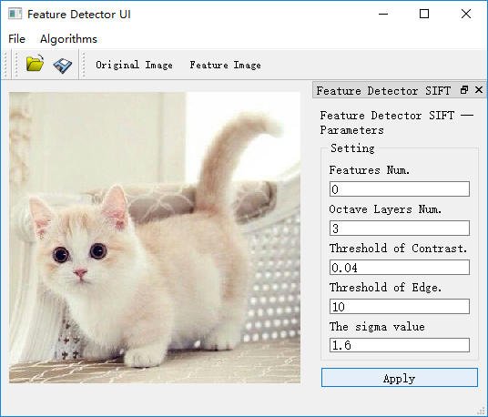
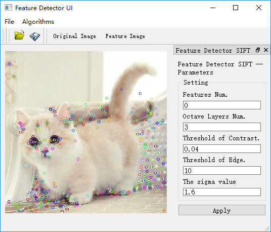
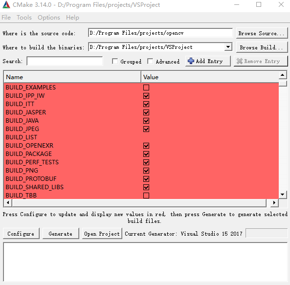
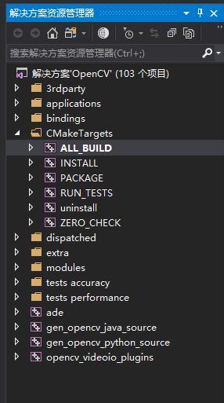
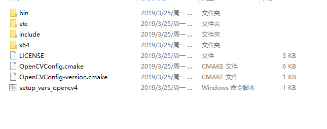

# FeatureDetector_Framework

There are Deme UI examples.




## 1. install

opencv 4.0+
Qt 5.8
Visual Studio 2017 (vc15)

### 1.1 install opencv

It would be better to complie opencv by yourself, if you would like to use opencv extra modules.

I found it convinient to compile via Cmake and VS studio and if you follow this pattern,these  useful tools are required:

- cmake 3.1 or above (https://cmake.org/download/)
- git
- VS 2015 or 2017 (or some other versions )

firstly, download soure of opencv and opencv contrib

```git
cd project
git clone https://github.com/opencv/opencv.git
git clone https://github.com/opencv/opencv_contrib.git
```

and then, 

1. open Cmake and set the soure code path
`you dir/project/opencv` and choose a directory to build the binaries, such as, `you dir/project/cv_vsproject/`. 
2. clike configure and you are required to choose your compiler IDE (VS here), and to choose your platform (remeber win32 by default, and you should choose x64 in my suggestion).
3. after the configure is finish, you will find there are so many configurations for you to custom by yourself.


Here are some important settings you should pay attention to :

- set `BUILD_opencv_world` on.
- set `OPENCV_EXTRA_MOUDLES_PATH` to `you dir/project/opencv_contrib/modules`.
- set `OPENCV_ENABLE_NOFREE` on if you want to use nonfree algorithms such as `SIFT` and `SURF`.

Then click generate. It spends some time before you can open your project in `you dir/project/cv_vsproject/`.

1. Open the `Opencv.sln` and right clike `ALL_BUILD`  in Opencv Solution in `Debug` mode. 
2. repeat step 1 in `Release` mode.
3. right click `INSTALL` and build in `Release` mode.
4. repeat step 3 in `Debug` mode.



All the generated file will be included in `install` archive. And the generated binaries are included in direction `x64/v15/`.
you should set the `install/x64/vc/bin` direction to system environmental variables `path`, which will tell how to find *.DLL at runtime. 

And in your VS project you should add `install/include/` to your project include directories and add `install/x64/vc15/lib` to additional library directiories in Linker. The additional 
dependancy item `opencv_world410d.lib` in debug mode and `opencv_world450.lib` in release mode.



### 1.2 Set up this source

required:

- Qt ( 5.8+ msvc 2015 or 2017 compiler)
- Visual Studio IDE ( 2015 or 2017 in my best knowledge. ).

 you can edit this source either by Qt (opening .pro file) or by Visual Studio (opening .sln file).

## 2. Extend your Detector
